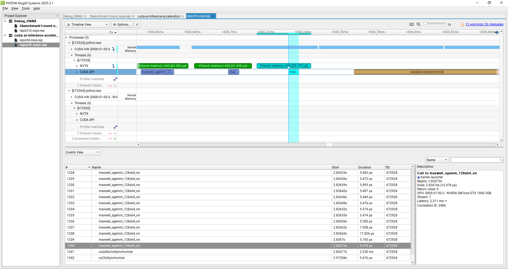
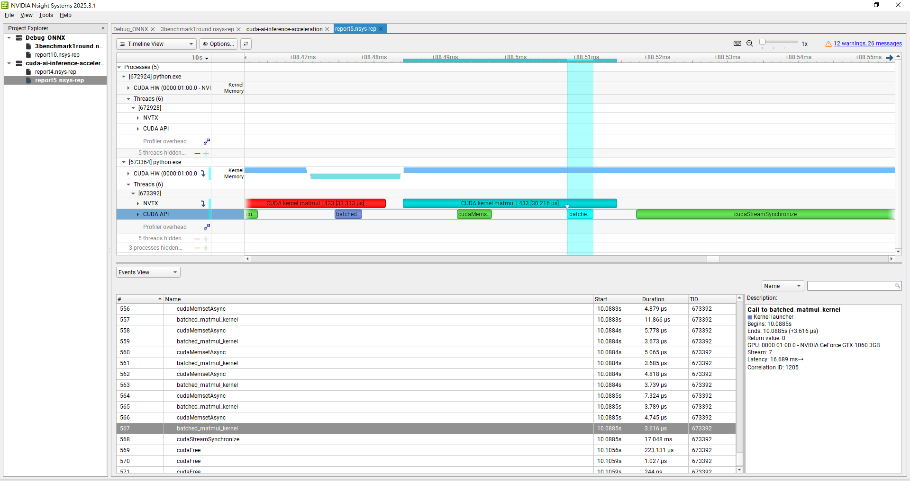

# 🚀 CUDA AI Inference Acceleration: Batched MatMul (PyTorch vs. Custom CUDA Kernel)

This project demonstrates how to implement and benchmark high-performance batched matrix multiplication on GPU using both **PyTorch’s official GPU API** and a **custom CUDA batched matmul kernel** (via Cupy dynamic loading).  
It provides a clear, practical baseline for AI/GPU optimization—ideal for interviews, technical portfolios, or anyone learning GPU infrastructure and profiling.

**A true highlight of this project is its in-depth GPU profiling: every kernel is timeline-annotated and analyzed with NVIDIA Nsight, providing clear visual insights into real-world performance bottlenecks.**

---


## 🌟 Key Features

- **Industry Baseline (PyTorch cuBLAS):**  
  Benchmarks with PyTorch’s batched GPU matmul as an industry-standard reference (cuBLAS backend).

- **Custom CUDA Kernel (via Cupy):**  
  Hand-crafted batched matmul kernel, dynamically loaded and executed from Python for fair head-to-head performance analysis.

- **Unified Benchmark & Profiling:**  
  One-click script runs both PyTorch and custom CUDA kernel, outputs side-by-side latency—
  **with code-level NVTX annotations and full NVIDIA Nsight timeline profiling**.

- **Extensible Engineering Structure:**  
  Designed for easy extension—add ONNX, TensorRT, OpenMP, or further profiling modules for advanced AI system and hardware benchmarking.

---

## 📁 Directory Structure

```
cuda-ai-inference-acceleration/
├── cuda_kernel/
│   ├── batched_matmul.cu         # CUDA kernel
│   ├── batched_matmul.py         # Python interface for CUDA kernel
├── pytorch_baseline/
│   └── run_pytorch.py            # PyTorch baseline
├── benchmark/
│   └── run_all.py                # Unified benchmark & runner
├── images/
│   ├── pytorch_matmul.PNG        # Nsight profiler: PyTorch timeline screenshot
│   ├── CUDA_kernel_matmul.PNG    # Nsight profiler: custom CUDA kernel timeline screenshot
├── README.md
└── requirements.txt
```

> * **images/**: All key profiler timeline screenshots for analysis & reporting.


---

## 🧑‍💻 Main Components

### 1. **PyTorch Baseline (`pytorch_baseline/run_pytorch.py`)**

> Runs batched matrix multiplication on GPU using PyTorch (cuBLAS backend), serving as the industry-standard reference for performance and profiling.  
> Includes NVTX annotation for timeline analysis.

### 2. **Custom CUDA Kernel (`cuda_kernel/batched_matmul.cu`, `batched_matmul.py`)**

> Implements a pure CUDA batched matmul kernel with batch-parallel execution, designed for direct comparison against cuBLAS.  
> Loaded and launched from Python via `cupy.RawModule` for seamless integration and profiling.  
> Includes per-iteration NVTX annotation to highlight kernel performance in the profiler timeline.

### 3. **Unified Benchmark Script (`benchmark/run_all.py`)**

> Runs both PyTorch and custom CUDA kernel benchmarks with a single command.  
> Prints side-by-side latency results, and ensures profiler-friendly workflow for timeline visualization and bottleneck analysis.

---

## 🚦 How to Run

### 1️⃣ Install dependencies

```bash
pip install -r requirements.txt
# Requires: NVIDIA GPU drivers and CUDA toolkit (tested with CUDA 11+)
```

### 2️⃣ Run all benchmarks (with profiler-ready workflow)

```bash
python benchmark/run_all.py
```

* This runs both the PyTorch and custom CUDA kernel batched matmul benchmarks, outputs average per-batch latency (ms), and supports profiler (Nsight Systems/Compute) integration out of the box.
* For GPU timeline profiling, simply launch this script under Nsight profiler; all NVTX annotations will appear in the timeline.


---

## 🧪 Experimental Results & Profiling Analysis

### 1. Quantitative Benchmark Results

- **PyTorch baseline (cuBLAS):** `0.080 ms per batch`
- **Custom CUDA kernel:** `0.379 ms per batch`
- (Each average of 50 rounds, batch=128, matrix size=64x64)

The PyTorch baseline is significantly faster than the custom kernel, with about a 4.7x performance gap.

---

### 2. Timeline Profiling & Bottleneck Analysis

To better understand the performance gap, I inserted clear markers at each matmul round using `nvtx.annotate`, and profiled the GPU timeline using Nsight Systems. All screenshots are stored in `/images`.

#### 📷 cuBLAS (PyTorch) Timeline

> Built-in PyTorch batched matmul is annotated in green. Each kernel (`maxwell_sgemm_128x64_nn`) takes only ~5μs, with tightly packed kernel launches and high SM utilization. There is minimal delay, and the cudaDeviceSynchronize region is extremely short.

#### 📷 Custom CUDA Kernel Timeline

> Each custom kernel call is marked in red, with a single kernel taking only about 3-4μs—not slow by itself, but the cudaDeviceSynchronize region is much longer, indicating that the kernel itself is not the main bottleneck.

---

### 3. Analysis & Technical Insights

**Key observations:**
- PyTorch baseline is much faster, but the timeline reveals that the per-kernel time is actually not so different.
- Therefore, I took a closer look at the cudaDeviceSynchronize section, which is where the host waits for all GPU work to finish.

**Root cause:**
- The cuBLAS matmul kernel and memory pipeline are highly optimized, with streamlined kernel launches and memory ops.
- Although the custom kernel is also fast per call, each round involves cupy dynamic memory allocation/freeing and kernel launch overhead (e.g., repeated cudaMemsetAsync, cudaFree in the timeline).
- These memory and launch operations are asynchronous and get queued on the GPU. When a cudaDeviceSynchronize() is finally called, it blocks until all queued work completes. As a result, measuring with time.time()   includes the total accumulated execution time of all prior operations in that loop, making the final sync appear to take much longer.

**Conclusion:**
- The custom kernel's performance bottleneck is not the computation itself, but system-level overhead from kernel launch, memory pipeline, and synchronization.
- This is why industry-standard practice is to use cuBLAS (PyTorch backend): it delivers highly optimized kernels, memory management, and execution flow.

---

### 4. Annotate Markers vs. time.time(): What’s the Difference?

* I inserted `nvtx.annotate()` inside the for loop for each matmul round. This creates a labeled region in the profiler timeline, grouping the corresponding GPU activity — such as kernel launches, CUDA API calls, memory operations, and synchronization events — so they can be visually correlated and aligned for analysis.
* However, `time.time()` is measured around the **entire** for loop, including all kernel launches, memory ops, and a final synchronize call—so the measured duration is much longer and includes all GPU-side waiting time.
* The annotated region in the timeline covers only a single matmul kernel, not the total CUDA pipeline wait.

#### Timing and Annotation Example

```python
t0 = time.time()
for _ in range(50):
    with nvtx.annotate("Pytorch matmul", color="green"):
        out = pytorch_batched_matmul(a, b)
torch.cuda.synchronize()
t1 = time.time()
print(f"PyTorch batched matmul: {(t1 - t0) * 1000 / 50:.3f} ms per batch")
```

* Here, `time.time()` measures the total duration including all kernel launches and the synchronization wait at the end, so the measured latency per batch includes all accumulated GPU delays—not just the kernel compute time itself.
* By contrast, the NVTX annotations inside the loop make each kernel invocation visible as a separate region in the timeline, enabling precise kernel-level performance analysis.

---

### 5. Project Insights

- This project demonstrates the full workflow for AI/GPU performance benchmarking: comparing PyTorch cuBLAS, a custom CUDA kernel, and analyzing real profiler data with clear, interpretable visualizations.
- This approach is essential for any AI infra/ML systems engineer: quantifying, profiling, and clearly communicating the source of performance gaps, both in numbers and with visual evidence.


---

## 📌 Technical Highlights

* **PyTorch / Deep Learning Engineering:** Demonstrates practical skills in PyTorch GPU tensor operations and industry-standard matmul workflows.
* **CUDA Kernel Programming:** Implements custom batched matrix multiplication, showcasing low-level GPU design: memory layout, grid/block/thread planning, and kernel launch strategy.
* **Cupy Integration:** Seamlessly bridges Python and CUDA, using dynamic compilation (no pybind11/manual C++ required) for easy kernel prototyping and extension.
* **End-to-End Profiling:** Unified, profiler-ready benchmark pipeline (with NVTX and Nsight), enabling actionable performance comparison—essential for AI/infra teams and interview preparation.

---

## ⚠️ Challenges & Solutions

**1. Profiling mismatch between `nvtx.annotate()` and `time.time()`**

* **Challenge:** Initial measurements showed a large discrepancy between profiler timeline and wall-clock timing.
* **Cause:** All asynchronous kernel launches and memory operations queued on the GPU are only waited on at `cudaDeviceSynchronize()`. As a result, `time.time()` measured at the end of the loop included the accumulated execution time of all prior operations.
* **Solution:** Inserted `nvtx.annotate()` inside each iteration to visually group GPU activity in the Nsight timeline, making it easier to correlate per-kernel compute time with total pipeline latency.

**2. Identifying the real bottleneck**

* **Challenge:** Per-kernel execution time for the custom kernel was close to cuBLAS, yet total latency was much higher.
* **Cause:** Overhead was due to repeated memory allocation/freeing and kernel launch costs, not computation.
* **Solution:** Used Nsight timeline analysis to pinpoint the overhead source, confirming that cuBLAS avoids these costs through optimized memory management and streamlined kernel launches.

**3. HIP execution limitation**

* **Challenge:** Implemented HIP version but could not execute in the current development environment.
* **Cause:** ROCm only supports Linux + AMD GPUs, and the HIP CUDA backend (for NVIDIA GPUs) is Linux-only, unavailable on Windows.
* **Solution:** Kept the HIP code integrated into the framework and documented environment requirements, ensuring the codebase is portable and ready for deployment on supported ROCm hardware.


---

## 🔥 Extension Ideas

- **HIP Porting:** Extend the custom CUDA kernel to HIP for AMD GPU compatibility; benchmark and profile on ROCm to compare NVIDIA vs. AMD hardware efficiency.
- **Multi-GPU Scaling:** Add support for multi-GPU batch parallelism and distributed execution, to study scale-up and scale-out performance (NCCL, ROCm RCCL).
- **FP16 & Mixed Precision:** Support half precision (FP16) and mixed precision inference/training for both CUDA and HIP backends.
- **Framework Integration:** Integrate with Triton, CUTLASS, or Compute Kernel (CK) for portable, high-performance batched matmul across CUDA, HIP, and potentially SYCL.
- **Deep Learning Framework Hooks:** Add plugins for direct PyTorch/TensorFlow extension (e.g., custom ops or PyTorch C++/CUDA/HIP extension) to enable transparent benchmarking in real models.
- **Compiler Optimization:** Experiment with compiler flags and graph compilers (LLVM, ROCm, TVM) for further kernel and system performance gains.
- **OpenMP/CPU Backend:** Implement OpenMP-based CPU version for full CPU vs. GPU (NVIDIA/AMD) comparison.
- **ONNX/TensorRT/ROCm-inference:** Integrate ONNX Runtime, TensorRT, and ROCm MIOpen for a complete end-to-end inference acceleration benchmark on all major platforms.

> *These extensions make the project a real-world testbed for AI system engineers, and are directly aligned with the requirements of modern GPU kernel roles at companies like AMD, NVIDIA, and beyond.*

---

## 📌 HIP Porting Attempt & Environment Limitation

As part of demonstrating **extensibility and cross-platform design**, this project includes a `hip_kernel/` module that implements the same batched matmul kernel using **HIP** for AMD ROCm platforms.

**Development process:**

* Rewrote CUDA kernel into HIP syntax (nearly identical due to HIP’s CUDA-like design).
* Integrated HIP kernel into the same benchmarking structure as the CUDA version.
* Verified that the code is ready for compilation and execution on supported platforms.

**Findings:**

* ROCm is officially supported **only on Linux + AMD GPUs**.
* **No ROCm runtime for Windows**; `cupy-rocm-*` wheels are not available for Windows.
* HIP also has a **CUDA backend** that allows HIP code to run on NVIDIA GPUs — but this backend works **only on Linux**, not Windows.

**Current environment:**

* **Windows + NVIDIA GPU** → HIP backend unavailable → HIP benchmarks skipped.

**Where HIP will run:**

| Environment                               | Description                                                                        | CUDA Kernel | HIP Kernel |
| ----------------------------------------- | ---------------------------------------------------------------------------------- | ----------- | ---------- |
| Windows + NVIDIA GPU                      | Your current machine — runs CUDA only.                                             | ✅           | ❌          |
| Linux + NVIDIA GPU (**HIP CUDA backend**) | HIP code compiled to CUDA API calls and executed on NVIDIA GPUs under Linux.       | ✅           | ✅          |
| Linux + AMD GPU (**ROCm backend**)        | HIP code compiled to ROCm API calls and executed natively on AMD GPUs under Linux. | ❌           | ✅          |

**Legend:**

* **HIP CUDA backend** → HIP code translated into CUDA API calls, runs on NVIDIA GPUs (Linux only).
* **ROCm backend** → HIP code runs natively on AMD GPUs using ROCm runtime (Linux only).

**Key takeaway for interviewers:**

* Demonstrates ability to design a **portable GPU benchmarking framework**.
* Shows hands-on HIP implementation experience, even without access to the target platform.
* HIP module is ready for deployment and benchmarking on supported ROCm hardware.

---

## 📣 Why This Project?

Built from scratch, this project demonstrates the **full workflow needed for modern AI engineering and infrastructure roles**: from high-level PyTorch development, to custom CUDA kernel optimization, to real-world benchmarking and timeline-based profiling. It proves ability in both software stack integration and low-level bottleneck analysis—making it valuable for real-world AI infrastructure, research, and advanced GPU system development.

---

## 👤 Author

Wang Chen Han
[hank851107@gmail.com](mailto:hank851107@gmail.com)
[GitHub: HankWang-WL](https://github.com/HankWang-WL)

---

## License

MIT License
