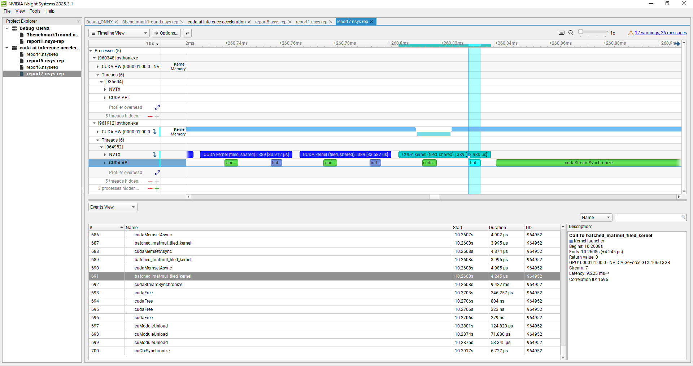

# 🚀 CUDA AI Inference Acceleration: Batched MatMul (PyTorch vs. Custom CUDA Kernel)

This project demonstrates how to implement and benchmark high-performance batched matrix multiplication on GPU using both **PyTorch’s official GPU API** and a **custom CUDA batched matmul kernel** (via CuPy dynamic loading). It provides a clear, practical baseline for AI/GPU optimization.

The project’s optimization journey was motivated by one clear goal: **to progressively approach PyTorch’s cuBLAS performance**. Starting from a naive kernel, I introduced tiling (O1), larger tiles with vectorized memory access (O2), and finally register blocking with float4 loads (O2\_1). Each step was driven by profiler evidence and delivered measurable gains toward closing the gap with cuBLAS.

**A key highlight is the full GPU profiling workflow:**

* **Step 1 – Profiling:** NVTX markers were inserted into the code, and NVIDIA Nsight was used to capture detailed GPU timelines. The initial profiling revealed that the custom kernel was **much slower** than PyTorch’s cuBLAS baseline.
* **Step 2 – Bottleneck Detection:** Timeline analysis showed that most of the extra latency was concentrated in `cudaStreamSynchronize`, indicating **computation inefficiency** rather than memory transfer delays.
* **Step 3 – Optimization:** Kernel-level bottlenecks were identified and addressed by introducing optimizations step by step — O1 (tiled16 + shared memory), O2 (tiled32 + float2 + multi-col/thread), and O2\_1 (tiled32 + 2×2 + float4 register blocking).
* **Result:** The optimized kernels achieved substantial speedups over the naive version while systematically reducing the performance gap with cuBLAS.


---

## 🌟 Key Features

* **Industry Baseline (PyTorch cuBLAS):**
  Uses PyTorch’s batched matmul with cuBLAS backend as the gold-standard performance reference.

* **Custom CUDA Kernels (via CuPy):**
  Hand-written CUDA kernels, integrated with Python through CuPy’s `RawModule`, for direct comparison against cuBLAS.

* **Step-by-Step Optimizations:**
  From naive → tiled16 (O1) → tiled32 + float2 (O2) → 2×2 + float4 (O2\_1). Each step targeted specific bottlenecks, achieving measurable gains.

| Variant             | Time (ms) | Gain vs Previous | Gain vs Naive |
| ------------------- | --------- | ---------------- | ------------- |
| PyTorch cuBLAS      | 0.100     | —                | +75% faster   |
| Naive               | 0.406     | —                | —             |
| O1 (tiled16)        | 0.244     | +40%             | +40%          |
| O2 (tiled32+float2) | 0.170     | +30%             | +58%          |
| O2\_1 (2×2+float4)  | 0.142     | +16%             | +65%          |

* **Profiling-Driven Process:**
  Combined NVTX annotations, Nsight Systems timelines, and wall-clock timing (`time.time()`) to guide each optimization stage.

* **Unified Benchmark Script:**
  A single runner benchmarks PyTorch, naive CUDA, and optimized kernels side-by-side, outputting per-batch latency with profiler-ready NVTX markers.


---

## 📁 Directory Structure

```
cuda-ai-inference-acceleration/
├── benchmark/                       # Benchmark scripts
│   └── run_all.py                    # One-click benchmark runner (PyTorch / CUDA / HIP)
│
├── cuda_kernel/                      # Custom CUDA kernels
│   ├── batched_matmul.cu              # Original batched matmul kernel
│   ├── batched_matmul_tiled.cu        # Optimized tiled + shared memory version
│   ├── batched_matmul.py              # Python interface (CuPy kernel invocation)
│   ├── batched_matmul_tiled_O2        # Further optimized: TILE=32 + float2 + multi-col/thread
│   └── batched_matmul_tiled_O2_1      # Advanced optimization: TILE=32 + float4 + 2x2 register blocking
│
├── hip_kernel/                        # HIP kernels (AMD ROCm platform)
│   ├── batched_matmul_hip.hip         # HIP version of batched matmul kernel
│   └── run_hip.py                     # HIP test script (runs on ROCm or HIP CUDA backend)
│
├── images/                            # Images for README
│   ├── pytorch_matmul.PNG             # Nsight timeline: PyTorch baseline
│   ├── CUDA_kernel_matmul.PNG         # Nsight timeline: original CUDA kernel
│   ├── CUDA_kernel_matmul_tiled.PNG   # Nsight timeline: optimized tiled CUDA kernel
│   └── optimization_overview.PNG      # Nsight timeline: overall optimization
│
├── nsight_reports/                    # Nsight profiling reports (.nsys-rep)
│   └── cuBLAS_O1_O2_O2.1.nsys-rep # Profiling results for PyTorch, original CUDA, and tiled CUDA
│
├── pytorch_baseline/                  # PyTorch baseline implementation
│   └── run_pytorch.py                 # cuBLAS-based batched matmul baseline
│
├── LICENSE                            # License file
├── README.md                          # Project documentation
└── requirements.txt                   # Python dependency list

```

> * **images/**: All key profiler timeline screenshots for analysis & reporting.


---

## 🧑‍💻 Main Components

### 1. **PyTorch Baseline (`pytorch_baseline/run_pytorch.py`)**

> Executes batched matrix multiplication on GPU using PyTorch’s cuBLAS backend, serving as the performance baseline.
> Includes NVTX annotations for kernel-level profiling with NVIDIA Nsight.

### 2. **Custom CUDA Kernel (`cuda_kernel/batched_matmul.cu`, `batched_matmul.py`)**

> Implements a pure CUDA batched matmul kernel with batch-parallel execution for direct comparison against cuBLAS.
> Initial profiling showed it was slower due to long synchronization waits (`cudaStreamSynchronize`), pointing to computation inefficiency.
> Optimized with a **tiled + shared memory** design, improving memory access and reducing execution time.
> Integrated with Python via `cupy.RawModule` for easy benchmarking and profiling.

### 3. **Unified Benchmark Script (`benchmark/run_all.py`)**

> Runs PyTorch, naive CUDA, and optimized CUDA benchmarks in a single command.
> Outputs side-by-side latency results and includes NVTX markers for profiler-friendly workflows, enabling before-and-after optimization comparison.


---

## 🚦 How to Run

### 1️⃣ Install dependencies

```bash
pip install -r requirements.txt
# Requires: NVIDIA GPU drivers and CUDA toolkit (tested with CUDA 11+)
```

### 2️⃣ Run all benchmarks (with profiler-ready workflow)

```bash
python benchmark/run_all.py
```

* Runs PyTorch, naive CUDA, and optimized CUDA batched matmul benchmarks.
* Outputs average per-batch latency (ms) for all implementations side-by-side.
* Fully compatible with Nsight Systems/Compute — NVTX markers are embedded so kernel and synchronization regions appear clearly in the timeline.
* For profiling, launch this script under Nsight; each benchmark iteration is annotated for detailed performance analysis.


---

## 🧪 Experimental Results & Profiling Analysis

### 1. Quantitative Benchmark Results

| Implementation                   | Avg Latency (ms per batch) | Speedup vs. Naive |
| -------------------------------- | -------------------------- | ----------------- |
| **PyTorch baseline (cuBLAS)**    | 0.080                      | 5.08×             |
| **CUDA kernel (naive)**          | 0.406                      | 1.00×             |
| **CUDA kernel (tiled + shared)** | 0.244                      | 1.66×             |

*(Each average of 50 rounds, batch=128, matrix size=64×64)*

The PyTorch baseline is the fastest due to cuBLAS optimizations, but the optimized tiled CUDA kernel significantly outperforms the naive version by \~40%.


### 2. Timeline Profiling & Bottleneck Analysis

Using NVTX annotations and Nsight Systems, each matmul iteration was profiled to identify bottlenecks. Screenshots are stored in `/images`.

#### 📷 cuBLAS (PyTorch) Timeline


cuBLAS kernels (green) execute in tightly packed sequences with minimal idle time. Synchronization waits are extremely short, indicating highly efficient computation and memory pipelines.

#### 📷 CUDA Kernel (Naive)


Kernel launches (red) are individually fast (\~3-4 μs) but followed by long `cudaStreamSynchronize` waits, revealing inefficiencies in computation and memory access.

#### 📷 CUDA Kernel (Tiled + Shared Memory)


Optimized kernel reduces synchronization delays by improving memory access patterns, lowering per-batch runtime from 0.374 ms to 0.232 ms.


### 3. Analysis & Technical Insights

**Key observations:**

* PyTorch cuBLAS remains the gold standard for speed due to deeply tuned kernels and memory pipelines.
* The naive CUDA kernel’s slowdown stemmed from inefficient memory access and computation, not just kernel launch overhead.
* Tiled + shared memory optimization cut per-batch latency by \~40% compared to the naive version.

**Root cause & resolution:**

* Nsight timelines showed long waits at `cudaStreamSynchronize`, pointing to computation inefficiency.
* Rewriting the kernel to use shared memory tiling improved memory locality and reduced redundant global memory accesses, leading to significant speedup.

**Conclusion:**

* Profiling-driven optimization is essential for GPU performance tuning.
* Even without matching cuBLAS, targeted optimizations can deliver large performance gains over naive implementations.


### 4. Annotate Markers vs. `time.time()`: What’s the Difference?

* `nvtx.annotate()` is inserted inside the for loop for each matmul round, creating a labeled region in the Nsight profiler timeline. This groups all GPU activity for that round — kernel launches, CUDA API calls, memory operations, and synchronization events — so they can be visually correlated for analysis.
* `time.time()` is measured around the **entire** loop, including all kernel launches, memory operations, and the final `cudaStreamSynchronize()` call. This means the measured duration includes all accumulated GPU-side waiting time.
* NVTX annotations highlight **per-kernel compute behavior**, while `time.time()` measures the **end-to-end latency** for the full set of iterations.

#### Timing and Annotation Example

```python
t0 = time.time()
for _ in range(50):
    with nvtx.annotate("Pytorch matmul", color="green"):
        out = pytorch_batched_matmul(a, b)
torch.cuda.synchronize()
t1 = time.time()
print(f"PyTorch batched matmul: {(t1 - t0) * 1000 / 50:.3f} ms per batch")
```

* In this example, `time.time()` reflects the total loop execution time (compute + memory ops + synchronization), while NVTX markers expose each kernel call in the profiler timeline.
* **Why it matters:** This dual measurement approach helped reveal that the naive CUDA kernel’s delay was dominated by synchronization waits, guiding the optimization toward better memory access patterns.


### 5. Project Insights

* Demonstrates the **full profiling-driven optimization workflow**: starting from baseline measurement, through identifying bottlenecks, to applying kernel-level improvements.
* Combines **quantitative benchmarking** with **visual profiler evidence** to clearly pinpoint performance gaps.
* Shows how integrating NVTX + Nsight with wall-clock timing can uncover inefficiencies invisible to a single measurement method.
* Validates that targeted optimization (e.g., tiled + shared memory) can achieve substantial speedups even if cuBLAS remains faster, reinforcing the value of systematic performance engineering.


### 6.  Tile Size & Memory Coalescing Insight

- Current kernel uses **tile=16**.
- Warp = 32 threads → **tile=32** could improve memory coalescing by aligning 32 consecutive threads with 32 consecutive addresses in a single transaction.
- This reduces global memory latency and could further cut runtime.

 **Trade-off:**
- Tile=32 increases per-block shared memory usage, lowering the number of resident blocks per SM (reduced occupancy).
- It is **not guaranteed faster** — must be validated with profiling.

 **Future Optimization:** Test tile=32 to check if coalescing benefit outweighs occupancy drop.

---

##  Technical Highlights

* **PyTorch GPU Engineering:** Implements batched matmul using PyTorch’s cuBLAS backend as a performance reference.
* **CUDA Kernel Programming:** Designs and optimizes a custom batched matmul kernel, covering memory layout, grid/block/thread configuration, and kernel launch strategy.
* **CuPy Integration:** Bridges Python and CUDA via CuPy’s dynamic compilation, enabling rapid prototyping without pybind11 or manual C++ bindings.
* **End-to-End Profiling:** Embeds NVTX markers for Nsight profiling, supporting both per-kernel analysis and full end-to-end latency measurement to drive optimization decisions.

---

## ⚠️ Challenges & Solutions

**1. Kernel-Level Understanding Challenges**

* **Challenge:** Writing efficient CUDA kernels was harder than expected — GPU memory is fundamentally 1D linear, yet computations often require mapping to 2D/3D grid coordinates. Misunderstanding indexing easily causes wrong results or performance loss.
* **Learning:** Had to deeply understand thread/block hierarchy, memory addressing, and how to translate between logical (row/col) indices and physical memory layout.
* **Insight:** Realized that performance is not just about correctness — without concepts like parallel execution, coalesced memory access, and warp behavior, even a correct kernel can be 5–10× slower than cuBLAS.


**2. Identifying the Real Bottleneck**

* **Challenge:** Although each kernel’s launch time looked close to cuBLAS, the overall latency was still much higher.
* **Observation:** In the Nsight timeline, a long `cudaStreamSynchronize` segment appeared, making it unclear whether the slowdown came from computation or hidden overhead.
* **Learning Path:** I began with the simplest matmul kernel and optimized step by step. This showed me that the main bottleneck wasn’t just raw compute, but how memory was accessed and reused.
* **Outcome:** From this, I realized the bottleneck wasn’t *“sync overhead”*, but that the long `cudaStreamSynchronize` block in Nsight actually included **all kernel costs — global memory loads, shared memory traffic, and computation**. After introducing a **tiled + shared memory design**, the timeline clearly showed reduced memory stalls and a measurable speedup over the naive version.


**3. HIP execution limitation**

* **Challenge:** HIP kernel implemented but not executable in the current environment.
* **Cause:** ROCm supports only Linux + AMD GPUs; HIP CUDA backend for NVIDIA GPUs is Linux-only.
* **Solution:** Retained HIP implementation in the codebase with documentation, ready for deployment on supported platforms.

---

## 🔥 Extension Ideas

* **HIP Porting:** Benchmark and profile on ROCm for AMD GPU support.
* **Multi-GPU Scaling:** Implement batch parallelism and distributed execution.
* **FP16 & Mixed Precision:** Add half/mixed precision for CUDA and HIP.
* **Framework Integration:** Explore Triton, CUTLASS, or Compute Kernel (CK) for portable performance.
* **Deep Learning Hooks:** Add PyTorch/TensorFlow custom ops for transparent benchmarking.
* **Compiler Optimization:** Test LLVM, ROCm, TVM for kernel/system tuning.
* **CPU Backend:** Implement OpenMP CPU version for CPU vs. GPU comparisons.
* **ONNX/TensorRT/ROCm Inference:** Integrate for full-platform acceleration benchmarks.

> These extensions position the project as a versatile testbed for modern GPU kernel development across NVIDIA, AMD, and beyond.


---

## 📌 HIP Porting Attempt & Environment Limitation

As part of demonstrating **extensibility and cross-platform design**, this project includes a `hip_kernel/` module that implements the same batched matmul kernel using **HIP** for AMD ROCm platforms.

**Development process:**

* Rewrote CUDA kernel into HIP syntax (nearly identical due to HIP’s CUDA-like design).
* Integrated HIP kernel into the same benchmarking structure as the CUDA version.
* Verified that the code is ready for compilation and execution on supported platforms.

**Findings:**

* ROCm is officially supported **only on Linux + AMD GPUs**.
* **No ROCm runtime for Windows**; `cupy-rocm-*` wheels are not available for Windows.
* HIP also has a **CUDA backend** that allows HIP code to run on NVIDIA GPUs — but this backend works **only on Linux**, not Windows.

**Current environment:**

* **Windows + NVIDIA GPU** → HIP backend unavailable → HIP benchmarks skipped.

**Where HIP will run:**

| Environment                               | Description                                                                        | CUDA Kernel | HIP Kernel |
| ----------------------------------------- | ---------------------------------------------------------------------------------- | ----------- | ---------- |
| Windows + NVIDIA GPU                      | Your current machine — runs CUDA only.                                             | ✅           | ❌          |
| Linux + NVIDIA GPU (**HIP CUDA backend**) | HIP code compiled to CUDA API calls and executed on NVIDIA GPUs under Linux.       | ✅           | ✅          |
| Linux + AMD GPU (**ROCm backend**)        | HIP code compiled to ROCm API calls and executed natively on AMD GPUs under Linux. | ❌           | ✅          |

**Legend:**

* **HIP CUDA backend** → HIP code translated into CUDA API calls, runs on NVIDIA GPUs (Linux only).
* **ROCm backend** → HIP code runs natively on AMD GPUs using ROCm runtime (Linux only).

**Key takeaway for interviewers:**

* Demonstrates ability to design a **portable GPU benchmarking framework**.
* Shows hands-on HIP implementation experience, even without access to the target platform.
* HIP module is ready for deployment and benchmarking on supported ROCm hardware.

---

## 📌 CUDA vs ROCm: Environment Limitations and Porting Notes

While this project focuses on CUDA acceleration and profiling, an attempt was made to port the custom CUDA kernel to AMD's ROCm/HIP for broader hardware support. On Windows, native ROCm support is unavailable, which prevented successful execution on the development machine. This section documents the key differences and similarities between CUDA and HIP to demonstrate portability considerations.

### Environment Constraints

* **CUDA**: Fully supported on Windows with NVIDIA GPUs; Nsight profiling integrated.
* **ROCm/HIP**: No official Windows support for ROCm runtime; HIP development primarily targets Linux with AMD GPUs.
* **Impact**: Kernel compilation for HIP was possible in theory, but runtime execution and profiling required a Linux+AMD environment.

### CUDA ↔ HIP API Mapping Table

| CUDA API / Keyword                           | HIP Equivalent                                                        | Notes                                                                                             |
| -------------------------------------------- | --------------------------------------------------------------------- | ------------------------------------------------------------------------------------------------- |
| `#include <cuda_runtime.h>`                  | `#include <hip/hip_runtime.h>`                                        | Main runtime API header                                                                           |
| `cudaMalloc(ptr, size)`                      | `hipMalloc(ptr, size)`                                                | Memory allocation on device                                                                       |
| `cudaFree(ptr)`                              | `hipFree(ptr)`                                                        | Free device memory                                                                                |
| `cudaMemcpy(dst, src, size, cudaMemcpyKind)` | `hipMemcpy(dst, src, size, hipMemcpyKind)`                            | Host-device memory copy; kinds map 1:1 (e.g., `cudaMemcpyHostToDevice` → `hipMemcpyHostToDevice`) |
| `cudaMemset(ptr, val, size)`                 | `hipMemset(ptr, val, size)`                                           | Initialize memory on device                                                                       |
| `cudaDeviceSynchronize()`                    | `hipDeviceSynchronize()`                                              | Wait for all device operations to finish                                                          |
| `cudaGetErrorString(err)`                    | `hipGetErrorString(err)`                                              | Convert error code to readable string                                                             |
| `cudaStream_t`                               | `hipStream_t`                                                         | Stream handle type                                                                                |
| `cudaStreamCreate(&stream)`                  | `hipStreamCreate(&stream)`                                            | Create a stream                                                                                   |
| `cudaStreamSynchronize(s)`                   | `hipStreamSynchronize(s)`                                             | Wait for a specific stream                                                                        |
| `<<<grid, block>>>`                          | `hipLaunchKernelGGL(kernel, grid, block, sharedMem, stream, args...)` | HIP uses a macro for kernel launches instead of triple-angle bracket syntax                       |
| `__global__` / `__device__` / `__host__`     | Same in HIP                                                           | Kernel and function qualifiers remain identical                                                   |

### Takeaway

The porting process revealed that CUDA-to-HIP translation for this kernel would require minimal code changes thanks to HIP's close API parity. However, the primary blocker was the lack of ROCm runtime support on Windows, making practical execution and profiling on AMD GPUs infeasible in this environment.

---

## 📣 Why This Project?

Built from scratch, this project demonstrates the **full workflow for GPU performance engineering**: from high-level PyTorch implementation, to custom CUDA kernel design, to real-world benchmarking and timeline-based profiling. It showcases both **software stack integration** and **low-level bottleneck analysis**, proving capability to identify, analyze, and resolve performance issues through profiling-driven optimization. This makes it a valuable reference for AI infrastructure, research, and advanced GPU system development.


---

## 👤 Author

Wang Chen Han
[hank851107@gmail.com](mailto:hank851107@gmail.com)
[GitHub: HankWang-WL](https://github.com/HankWang-WL)

---

## License

MIT License


---


## 🌟 Key Features

* **Industry Baseline (PyTorch cuBLAS):**
  Benchmarks with PyTorch’s batched GPU matmul as an industry-standard reference (cuBLAS backend), serving as the primary performance baseline.

* **Custom CUDA Kernel (via CuPy):**
  Implements a hand-crafted batched matmul kernel, launched from Python using CuPy’s `RawModule`. Profiling initially showed it was slower than cuBLAS due to long synchronization waits.

* **Profiling-Driven Optimization:**
  NVTX annotations and NVIDIA Nsight timeline profiling were used to pinpoint that the slowdown came from computation inefficiency. A **tiled + shared memory** version was developed, cutting per-batch latency from 0.374 ms to 0.232 ms.

* **Unified Benchmark Framework:**
  A single script runs PyTorch, naive CUDA, and optimized CUDA benchmarks, outputting side-by-side latency with profiler-ready NVTX markers for in-depth analysis.

* **Extensible Engineering Structure:**
  Modular design allows easy integration of ONNX, TensorRT, HIP, or OpenMP backends, making it a flexible testbed for AI system and hardware benchmarking.


---

## 📁 Directory Structure

```
cuda-ai-inference-acceleration/
├── benchmark/                       # Benchmark scripts
│   └── run_all.py                    # One-click benchmark runner (PyTorch / CUDA / HIP)
│
├── cuda_kernel/                      # Custom CUDA kernels
│   ├── batched_matmul.cu              # Original batched matmul kernel
│   ├── batched_matmul_tiled.cu        # Optimized tiled + shared memory version
│   └── batched_matmul.py              # Python interface (CuPy kernel invocation)
│
├── hip_kernel/                        # HIP kernels (AMD ROCm platform)
│   ├── batched_matmul_hip.hip         # HIP version of batched matmul kernel
│   └── run_hip.py                     # HIP test script (runs on ROCm or HIP CUDA backend)
│
├── images/                            # Images for README
│   ├── pytorch_matmul.PNG             # Nsight timeline: PyTorch baseline
│   ├── CUDA_kernel_matmul.PNG         # Nsight timeline: original CUDA kernel
│   └── CUDA_kernel_matmul_tiled.PNG   # Nsight timeline: optimized tiled CUDA kernel
│
├── nsight_reports/                    # Nsight profiling reports (.nsys-rep)
│   └── cuBLAS-CUDA-CUDAtiled.nsys-rep # Profiling results for PyTorch, original CUDA, and tiled CUDA
│
├── pytorch_baseline/                  # PyTorch baseline implementation
│   └── run_pytorch.py                 # cuBLAS-based batched matmul baseline
│
├── LICENSE                            # License file
├── README.md                          # Project documentation
└── requirements.txt                   # Python dependency list

```

> * **images/**: All key profiler timeline screenshots for analysis & reporting.


---

## 🧑‍💻 Main Components

### 1. **PyTorch Baseline (`pytorch_baseline/run_pytorch.py`)**

> Executes batched matrix multiplication on GPU using PyTorch’s cuBLAS backend, serving as the performance baseline.
> Includes NVTX annotations for kernel-level profiling with NVIDIA Nsight.

### 2. **Custom CUDA Kernel (`cuda_kernel/batched_matmul.cu`, `batched_matmul.py`)**

> Implements a pure CUDA batched matmul kernel with batch-parallel execution for direct comparison against cuBLAS.
> Initial profiling showed it was slower due to long synchronization waits (`cudaStreamSynchronize`), pointing to computation inefficiency.
> Optimized with a **tiled + shared memory** design, improving memory access and reducing execution time.
> Integrated with Python via `cupy.RawModule` for easy benchmarking and profiling.

### 3. **Unified Benchmark Script (`benchmark/run_all.py`)**

> Runs PyTorch, naive CUDA, and optimized CUDA benchmarks in a single command.
> Outputs side-by-side latency results and includes NVTX markers for profiler-friendly workflows, enabling before-and-after optimization comparison.


---

## 🚦 How to Run

### 1️⃣ Install dependencies

```bash
pip install -r requirements.txt
# Requires: NVIDIA GPU drivers and CUDA toolkit (tested with CUDA 11+)
```

### 2️⃣ Run all benchmarks (with profiler-ready workflow)

```bash
python benchmark/run_all.py
```

* Runs PyTorch, naive CUDA, and optimized CUDA batched matmul benchmarks.
* Outputs average per-batch latency (ms) for all implementations side-by-side.
* Fully compatible with Nsight Systems/Compute — NVTX markers are embedded so kernel and synchronization regions appear clearly in the timeline.
* For profiling, launch this script under Nsight; each benchmark iteration is annotated for detailed performance analysis.


---

## 🧪 Experimental Results & Profiling Analysis

### 1. Quantitative Benchmark Results

| Implementation                   | Avg Latency (ms per batch) | Speedup vs. Naive |
| -------------------------------- | -------------------------- | ----------------- |
| **PyTorch baseline (cuBLAS)**    | 0.100                      | 4.06×             |
| **CUDA kernel (naive)**          | 0.406                      | 1.00×             |
| **CUDA kernel (tiled + shared)** | 0.244                      | 1.66×             |

*(Each average of 50 rounds, batch=128, matrix size=64×64)*

The PyTorch baseline is the fastest due to cuBLAS optimizations, but the optimized tiled CUDA kernel significantly outperforms the naive version by \~38%.


### 2. Timeline Profiling & Bottleneck Analysis

Using NVTX annotations and Nsight Systems, each matmul iteration was profiled to identify bottlenecks. Screenshots are stored in `/images`.

#### 📷 cuBLAS (PyTorch) Timeline


cuBLAS kernels (green) execute in tightly packed sequences with minimal idle time. Synchronization waits are extremely short, indicating highly efficient computation and memory pipelines.

#### 📷 CUDA Kernel (Naive)


Kernel launches (red) are individually fast (\~3-4 μs) but followed by long `cudaStreamSynchronize` waits, revealing inefficiencies in computation and memory access.

#### 📷 CUDA Kernel (Tiled + Shared Memory)


Optimized kernel reduces synchronization delays by improving memory access patterns, lowering per-batch runtime from 0.374 ms to 0.232 ms.


### 3. Analysis & Technical Insights

**Key observations:**

* PyTorch cuBLAS remains the gold standard for speed due to deeply tuned kernels and memory pipelines.
* The naive CUDA kernel’s slowdown stemmed from inefficient memory access and computation, not just kernel launch overhead.
* Tiled + shared memory optimization cut per-batch latency by \~40% compared to the naive version.

**Root cause & resolution:**

* Nsight timelines showed long waits at `cudaStreamSynchronize`, pointing to computation inefficiency.
* Rewriting the kernel to use shared memory tiling improved memory locality and reduced redundant global memory accesses, leading to significant speedup.

**Conclusion:**

* Profiling-driven optimization is essential for GPU performance tuning.
* Even without matching cuBLAS, targeted optimizations can deliver large performance gains over naive implementations.


### 4. Annotate Markers vs. `time.time()`: What’s the Difference?

* `nvtx.annotate()` is inserted inside the for loop for each matmul round, creating a labeled region in the Nsight profiler timeline. This groups all GPU activity for that round — kernel launches, CUDA API calls, memory operations, and synchronization events — so they can be visually correlated for analysis.
* `time.time()` is measured around the **entire** loop, including all kernel launches, memory operations, and the final `cudaStreamSynchronize()` call. This means the measured duration includes all accumulated GPU-side waiting time.
* NVTX annotations highlight **per-kernel compute behavior**, while `time.time()` measures the **end-to-end latency** for the full set of iterations.

#### Timing and Annotation Example

```python
t0 = time.time()
for _ in range(50):
    with nvtx.annotate("Pytorch matmul", color="green"):
        out = pytorch_batched_matmul(a, b)
torch.cuda.synchronize()
t1 = time.time()
print(f"PyTorch batched matmul: {(t1 - t0) * 1000 / 50:.3f} ms per batch")
```

* In this example, `time.time()` reflects the total loop execution time (compute + memory ops + synchronization), while NVTX markers expose each kernel call in the profiler timeline.
* **Why it matters:** This dual measurement approach helped reveal that the naive CUDA kernel’s delay was dominated by synchronization waits, guiding the optimization toward better memory access patterns.


### 5. Project Insights

* Demonstrates the **full profiling-driven optimization workflow**: starting from baseline measurement, through identifying bottlenecks, to applying kernel-level improvements.
* Combines **quantitative benchmarking** with **visual profiler evidence** to clearly pinpoint performance gaps.
* Shows how integrating NVTX + Nsight with wall-clock timing can uncover inefficiencies invisible to a single measurement method.
* Validates that targeted optimization (e.g., tiled + shared memory) can achieve substantial speedups even if cuBLAS remains faster, reinforcing the value of systematic performance engineering.


### 6.  Tile Size & Memory Coalescing Insight

- Current kernel uses **tile=16**.
- Warp = 32 threads → **tile=32** could improve memory coalescing by aligning 32 consecutive threads with 32 consecutive addresses in a single transaction.
- This reduces global memory latency and could further cut runtime.

 **Trade-off:**
- Tile=32 increases per-block shared memory usage, lowering the number of resident blocks per SM (reduced occupancy).
- It is **not guaranteed faster** — must be validated with profiling.

 **Future Optimization:** Test tile=32 to check if coalescing benefit outweighs occupancy drop.

---

##  Technical Highlights

* **PyTorch GPU Engineering:** Implements batched matmul using PyTorch’s cuBLAS backend as a performance reference.
* **CUDA Kernel Programming:** Designs and optimizes a custom batched matmul kernel, covering memory layout, grid/block/thread configuration, and kernel launch strategy.
* **CuPy Integration:** Bridges Python and CUDA via CuPy’s dynamic compilation, enabling rapid prototyping without pybind11 or manual C++ bindings.
* **End-to-End Profiling:** Embeds NVTX markers for Nsight profiling, supporting both per-kernel analysis and full end-to-end latency measurement to drive optimization decisions.

---

## ⚠️ Challenges & Solutions

**1. Kernel-Level Understanding Challenges**

* **Challenge:** Writing efficient CUDA kernels was harder than expected — GPU memory is fundamentally 1D linear, yet computations often require mapping to 2D/3D grid coordinates. Misunderstanding indexing easily causes wrong results or performance loss.
* **Learning:** Had to deeply understand thread/block hierarchy, memory addressing, and how to translate between logical (row/col) indices and physical memory layout.
* **Insight:** Realized that performance is not just about correctness — without concepts like parallel execution, coalesced memory access, and warp behavior, even a correct kernel can be 5–10× slower than cuBLAS.


**2. Identifying the Real Bottleneck**

* **Challenge:** Although each kernel’s launch time looked close to cuBLAS, the overall latency was still much higher.
* **Observation:** In the Nsight timeline, a long `cudaStreamSynchronize` segment appeared, making it unclear whether the slowdown came from computation or hidden overhead.
* **Learning Path:** I began with the simplest matmul kernel and optimized step by step. This showed me that the main bottleneck wasn’t just raw compute, but how memory was accessed and reused.
* **Outcome:** From this, I realized the bottleneck wasn’t *“sync overhead”*, but that the long `cudaStreamSynchronize` block in Nsight actually included **all kernel costs — global memory loads, shared memory traffic, and computation**. After introducing a **tiled + shared memory design**, the timeline clearly showed reduced memory stalls and a measurable speedup over the naive version.


**3. HIP execution limitation**

* **Challenge:** HIP kernel implemented but not executable in the current environment.
* **Cause:** ROCm supports only Linux + AMD GPUs; HIP CUDA backend for NVIDIA GPUs is Linux-only.
* **Solution:** Retained HIP implementation in the codebase with documentation, ready for deployment on supported platforms.

---

## 🔥 Extension Ideas

* **HIP Porting:** Benchmark and profile on ROCm for AMD GPU support.
* **Multi-GPU Scaling:** Implement batch parallelism and distributed execution.
* **FP16 & Mixed Precision:** Add half/mixed precision for CUDA and HIP.
* **Framework Integration:** Explore Triton, CUTLASS, or Compute Kernel (CK) for portable performance.
* **Deep Learning Hooks:** Add PyTorch/TensorFlow custom ops for transparent benchmarking.
* **Compiler Optimization:** Test LLVM, ROCm, TVM for kernel/system tuning.
* **CPU Backend:** Implement OpenMP CPU version for CPU vs. GPU comparisons.
* **ONNX/TensorRT/ROCm Inference:** Integrate for full-platform acceleration benchmarks.

> These extensions position the project as a versatile testbed for modern GPU kernel development across NVIDIA, AMD, and beyond.


---

## 📌 HIP Porting Attempt & Environment Limitation

As part of demonstrating **extensibility and cross-platform design**, this project includes a `hip_kernel/` module that implements the same batched matmul kernel using **HIP** for AMD ROCm platforms.

**Development process:**

* Rewrote CUDA kernel into HIP syntax (nearly identical due to HIP’s CUDA-like design).
* Integrated HIP kernel into the same benchmarking structure as the CUDA version.
* Verified that the code is ready for compilation and execution on supported platforms.

**Findings:**

* ROCm is officially supported **only on Linux + AMD GPUs**.
* **No ROCm runtime for Windows**; `cupy-rocm-*` wheels are not available for Windows.
* HIP also has a **CUDA backend** that allows HIP code to run on NVIDIA GPUs — but this backend works **only on Linux**, not Windows.

**Current environment:**

* **Windows + NVIDIA GPU** → HIP backend unavailable → HIP benchmarks skipped.

**Where HIP will run:**

| Environment                               | Description                                                                        | CUDA Kernel | HIP Kernel |
| ----------------------------------------- | ---------------------------------------------------------------------------------- | ----------- | ---------- |
| Windows + NVIDIA GPU                      | Your current machine — runs CUDA only.                                             | ✅           | ❌          |
| Linux + NVIDIA GPU (**HIP CUDA backend**) | HIP code compiled to CUDA API calls and executed on NVIDIA GPUs under Linux.       | ✅           | ✅          |
| Linux + AMD GPU (**ROCm backend**)        | HIP code compiled to ROCm API calls and executed natively on AMD GPUs under Linux. | ❌           | ✅          |

**Legend:**

* **HIP CUDA backend** → HIP code translated into CUDA API calls, runs on NVIDIA GPUs (Linux only).
* **ROCm backend** → HIP code runs natively on AMD GPUs using ROCm runtime (Linux only).

**Key takeaway for interviewers:**

* Demonstrates ability to design a **portable GPU benchmarking framework**.
* Shows hands-on HIP implementation experience, even without access to the target platform.
* HIP module is ready for deployment and benchmarking on supported ROCm hardware.

---

## 📌 CUDA vs ROCm: Environment Limitations and Porting Notes

While this project focuses on CUDA acceleration and profiling, an attempt was made to port the custom CUDA kernel to AMD's ROCm/HIP for broader hardware support. On Windows, native ROCm support is unavailable, which prevented successful execution on the development machine. This section documents the key differences and similarities between CUDA and HIP to demonstrate portability considerations.

### Environment Constraints

* **CUDA**: Fully supported on Windows with NVIDIA GPUs; Nsight profiling integrated.
* **ROCm/HIP**: No official Windows support for ROCm runtime; HIP development primarily targets Linux with AMD GPUs.
* **Impact**: Kernel compilation for HIP was possible in theory, but runtime execution and profiling required a Linux+AMD environment.

### CUDA ↔ HIP API Mapping Table

| CUDA API / Keyword                           | HIP Equivalent                                                        | Notes                                                                                             |
| -------------------------------------------- | --------------------------------------------------------------------- | ------------------------------------------------------------------------------------------------- |
| `#include <cuda_runtime.h>`                  | `#include <hip/hip_runtime.h>`                                        | Main runtime API header                                                                           |
| `cudaMalloc(ptr, size)`                      | `hipMalloc(ptr, size)`                                                | Memory allocation on device                                                                       |
| `cudaFree(ptr)`                              | `hipFree(ptr)`                                                        | Free device memory                                                                                |
| `cudaMemcpy(dst, src, size, cudaMemcpyKind)` | `hipMemcpy(dst, src, size, hipMemcpyKind)`                            | Host-device memory copy; kinds map 1:1 (e.g., `cudaMemcpyHostToDevice` → `hipMemcpyHostToDevice`) |
| `cudaMemset(ptr, val, size)`                 | `hipMemset(ptr, val, size)`                                           | Initialize memory on device                                                                       |
| `cudaDeviceSynchronize()`                    | `hipDeviceSynchronize()`                                              | Wait for all device operations to finish                                                          |
| `cudaGetErrorString(err)`                    | `hipGetErrorString(err)`                                              | Convert error code to readable string                                                             |
| `cudaStream_t`                               | `hipStream_t`                                                         | Stream handle type                                                                                |
| `cudaStreamCreate(&stream)`                  | `hipStreamCreate(&stream)`                                            | Create a stream                                                                                   |
| `cudaStreamSynchronize(s)`                   | `hipStreamSynchronize(s)`                                             | Wait for a specific stream                                                                        |
| `<<<grid, block>>>`                          | `hipLaunchKernelGGL(kernel, grid, block, sharedMem, stream, args...)` | HIP uses a macro for kernel launches instead of triple-angle bracket syntax                       |
| `__global__` / `__device__` / `__host__`     | Same in HIP                                                           | Kernel and function qualifiers remain identical                                                   |

### Takeaway

The porting process revealed that CUDA-to-HIP translation for this kernel would require minimal code changes thanks to HIP's close API parity. However, the primary blocker was the lack of ROCm runtime support on Windows, making practical execution and profiling on AMD GPUs infeasible in this environment.

---

## 📣 Why This Project?

Built from scratch, this project demonstrates the **full workflow for GPU performance engineering**: from high-level PyTorch implementation, to custom CUDA kernel design, to real-world benchmarking and timeline-based profiling. It showcases both **software stack integration** and **low-level bottleneck analysis**, proving capability to identify, analyze, and resolve performance issues through profiling-driven optimization. This makes it a valuable reference for AI infrastructure, research, and advanced GPU system development.


---

## 🚀 O2 Optimization Results

The optimization path was driven by one clear goal: **reduce the performance gap with cuBLAS, and test whether a hand‑written kernel could approach or even surpass it on GTX1060**. Starting from a naive baseline, each step introduced a targeted optimization inspired by profiler evidence and GEMM best practices.

Using **time.time() measurements** (50 iterations per batch, synchronized after each loop):

| Variant                           | Time (ms) |  Gain vs Previous |     Gain vs Naive |
| --------------------------------- | --------: | ----------------: | ----------------: |
| PyTorch cuBLAS                    | **0.100** |                 — |   **+75% faster** |
| Naive                             | **0.406** |                 — |                 — |
| O1 (tiled16)                      | **0.244** | **+40%** vs Naive |          **+40%** |
| O2 (TILE=32, float2, 2col/thread) | **0.170** |    **+30%** vs O1 | **+58%** vs Naive |
| O2\_1 (2×2 + float4)              | **0.142** |    **+16%** vs O2 | **+65%** vs Naive |

### Storyline

* **Naive → O1:** Introduced tiling + shared memory to cut redundant global memory loads, giving +40% gain.
* **O1 → O2:** To **get closer to (and test whether I could surpass) cuBLAS**, I enlarged the tile to 32, switched to float2 vectorized loads, and had each thread compute multiple outputs. This reduced memory pressure and gave another +30% improvement.
* **O2 → O2\_1:** Added register blocking (2×2 per thread) and float4 loads. This further reduced global memory transactions and increased compute reuse, yielding +16% over O2.

Even though the O2\_1 kernel still runs \~42% slower than cuBLAS (0.142 vs 0.100 ms), the progression shows a systematic path of improvements and clear reasoning behind each step.

---

## Profiling Story (with Nsight Systems)

The figure below (screenshot of Nsight Systems timeline) shows the progression of optimizations:


* **Naive (red):** Kernel runtime dominated, loop \~18–19 ms (50 iters), per-batch \~0.406 ms.
* **O1 tiled16 (blue):** Shared-memory tiling reduces redundant loads → \~11 ms per loop, per-batch \~0.244 ms (**+40% gain**).
* **O2 tiled32 + float2 (green):** Larger tile, vectorized loads, 2 cols/thread → \~7.7 ms per loop, per-batch \~0.170 ms (**+30% gain vs O1**).
* **O2\_1 2×2 + float4 (yellow):** Register blocking + float4 loads → \~5.7 ms per loop, per-batch \~0.142 ms (**+16% gain vs O2**).

---

## Key Insights

* GPU timeline shows **>94% Kernels, <6% Memory (100% memset)** → workload is **compute dominated**, not PCIe/memcpy bound.
* Gains come from **reducing memory transactions** (float2/float4 vectorization) and **increasing compute reuse** (register blocking).
* Even without Nsight Compute counters (unsupported on GTX1060/Windows), Nsight Systems timeline + latency measurements tell a clear story.

---

## GPU Bottleneck Clues

Since Nsight Compute counters are not available on GTX1060/Windows, I used simple signals from the timeline and common GEMM behavior to **guess where the bottleneck is**. The idea is to distinguish whether the kernel is mostly **waiting for data (memory-bound)** or **busy doing math (compute-bound)**.

| Indicator                        | If Too High → Means…                                                            | If Too Low → Means…                                | What I can do                                                           |
| -------------------------------- | ------------------------------------------------------------------------------- | -------------------------------------------------- | ----------------------------------------------------------------------- |
| **Memory Occupation**            | GPU spends most of the time waiting for data from memory → likely memory-bound  | Memory system under-used → likely compute-bound    | Use tiling, shared memory reuse, vectorized loads/stores                |
| **Memory Throughput (GB/s)**     | Close to hardware peak but still slow → memory bottleneck                       | Far from peak → overhead or compute bottleneck     | Improve coalescing, use `float2/float4` loads, reduce redundant traffic |
| **Compute Occupation**           | Many warps active but still slow → threads stalled (e.g., waiting on registers) | Very few warps active → not enough to hide latency | Balance register usage vs occupancy; adjust tile size                   |
| **Compute Throughput (FLOPs/s)** | Close to peak → compute-bound (spending all time on math)                       | Far from peak → memory-bound or underutilized      | Increase data reuse, vectorize, overlap load and compute                |

### My Current Estimation (GTX1060, O2\_1)

* **Memory:** Not maxed out anymore; switching from float2 → float4 reduced memory traffic, so earlier kernels were partly memory-bound.
* **Compute:** High usage, since GPU spends >94% of time in kernels, and latency still improves with more per-thread work. Shows that earlier versions under-used compute pipelines.
* **Overall:** O2\_1 is in a state where memory is improved, but compute is not fully saturated. Next step is to improve pipelining (e.g., double-buffering) to push closer to cuBLAS.

> In short: **Memory-bound = waiting for data. Compute-bound = waiting for math.** My kernels started off memory-bound, and step by step I moved them toward compute-bound, which is closer to cuBLAS efficiency.

---

## Next Steps

* **Double-buffering shared tiles (compute while loading):** While computing the current tile, asynchronously load the next tile into shared memory, overlapping data movement with computation.

* **Pad matrix dimensions (avoid fragmented access):** Pad matrix sizes to multiples of 4 or 32 to ensure clean usage of `float2` / `float4` vectorized loads and stores, avoiding fallback to slower scalar operations at boundaries.

* **Learn and integrate CUTLASS:** CUTLASS demonstrates industry-standard GEMM kernel design: multi-level tiling, double-buffering pipelines, and vectorized epilogues. By comparing against my O2\_1 kernel, I can identify which optimization techniques are still missing.

* **Validate with Nsight Compute on newer GPUs (e.g., NVIDIA RTX 30/40 series):** On Ampere-class GPUs such as RTX 3080/3090 or newer, Nsight Compute can be used to examine stall breakdowns and roofline analysis for more detailed bottleneck validation.

* **Note on Tensor Cores:** GTX1060 (Pascal, SM61) does not support Tensor Core mixed-precision compute. cuBLAS also falls back to SIMT kernels for FP32 GEMM on this GPU, so enabling Tensor Core paths would not provide any benefit.


---


## 👤 Author

Wang Chen Han
[hank851107@gmail.com](mailto:hank851107@gmail.com)
[GitHub: HankWang-WL](https://github.com/HankWang-WL)

---

## License

MIT License